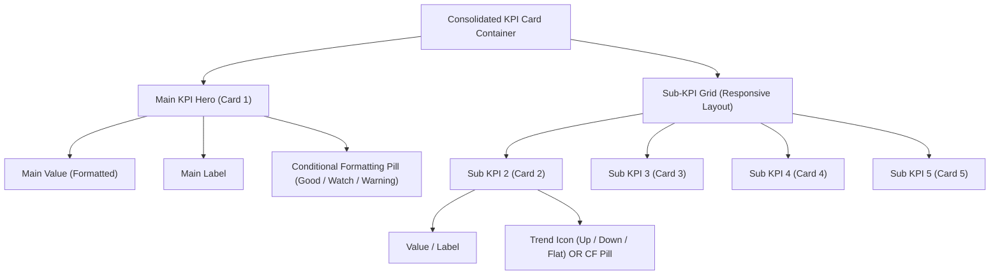

# Consolidated KPI Card Visual for Power BI

[](https://powerbi.microsoft.com/)
[](https://www.typescriptlang.org/)
[](https://opensource.org/licenses/MIT)

A premium, high-performance, and feature-rich consolidated key performance indicator (KPI) card visual for **Microsoft Power BI**. This visual allows you to present a clean, high-impact **Main KPI** accompanied by up to **four auxiliary Sub-KPIs** in an elegant, responsive 2x2 grid layout. It includes built-in conditional formatting, adaptive trend icons, and extensive aesthetic customization options to fit any corporate theme.

---

## 🎯 Key Features

- **🏆 Main KPI Hero Section**: A large, centered or aligned focal point at the top showing your primary metric (Card 1) with customizable fonts and dynamic conditional states.
- **🎛️ 2x2 Sub-KPI Grid**: Showcase up to 4 supporting metrics (Cards 2–5) with individual show/hide toggles to dynamically adapt to the available screen space.
- **🚦 Advanced Conditional Formatting (CF)**: 
  - Dynamic status evaluation: **Good**, **Watch (Neutral)**, and **Warning (Bad)**.
  - Fully customizable threshold triggers and color definitions.
  - Beautiful status pills with custom SVG micro-icons (Check, Alert, Warning).
- **📈 Automatic Trend Analytics**: When conditional formatting is disabled, the visual auto-detects positive/negative/neutral movement relative to zero and renders clean SVG trend indicators (Up / Down / Flat).
- **💎 Premium Design Controls**:
  - Global card shadow (Glassmorphism effect) and custom rounded corner radius.
  - Adjustable grids gaps, borders, alignment, and background/accent colors.
  - Intelligent big-number formatting (Auto-scaling to K, M, B with precision rules).

---

## 📐 Layout Architecture

The visual elements are organized dynamically based on your data bindings:



---

## 📊 Data Roles & Bindings

To render the visual, map your metrics under the following fields in the Power BI **Fields Pane**:

| Data Role | Display Name | Kind | Description |
| :--- | :--- | :--- | :--- |
| `measure1` | **Card 1 – Measure** | Measure | The hero primary metric (displayed at the top). |
| `measure2` | **Card 2 – Measure** | Measure | Auxiliary metric in the sub-grid (Row 1, Column 1). |
| `measure3` | **Card 3 – Measure** | Measure | Auxiliary metric in the sub-grid (Row 1, Column 2). |
| `measure4` | **Card 4 – Measure** | Measure | Auxiliary metric in the sub-grid (Row 2, Column 1). |
| `measure5` | **Card 5 – Measure** | Measure | Auxiliary metric in the sub-grid (Row 2, Column 2). |

---

## ⚙️ Customization & Formatting Properties

All styling options are accessible via the **Format Pane** in Power BI Desktop:

### 🧩 Individual Card Settings (Cards 1 to 5)
* **Show**: Toggle visibility of the individual card.
* **Title**: Custom text label for the KPI (defaults to the measure name).
* **Alignment**: Text alignment (`Left`, `Center`, or `Right`).
* **Font Sizes**: Set label font size and large value font size separately.
* **Colors**: Customize the primary Text Color, Background Color, and Accent Color.
* **Conditional Formatting**:
  - Enable/Disable toggle.
  - Threshold limits: Good threshold value, Bad threshold value.
  - Direction: **Higher is Better** (true/false toggle to invert evaluation logic).
  - Custom Color Palettes for **Good Color**, **Bad Color**, and **Neutral Color**.

### 🎨 Global Layout Settings
* **Card Gap**: Control spacing (in pixels) between sub-grid cards.
* **Corner Radius**: Adjust card rounding (from sharp corners to modern rounded cards).
* **Border & Outline**: Toggle card border visibility and set a custom border color.
* **Shadow Effect**: Enable or disable smooth box-shadows for a floating depth look.
* **Trend Icons**: Global toggle to display up/down/flat trends if conditional formatting is disabled.

---

## 🛠️ Development & Environment Setup

If you wish to modify or build this visual locally, ensure you have [Node.js](https://nodejs.org/) installed and follow these steps:

### 1. Clone the repository and install dependencies
```bash
npm install
```

### 2. Start the local Power BI developer server
This boots up the development server and serves the visual locally on port `8080`:
```bash
npm run start
```

### 3. Compile and Package the Visual
To compile the TypeScript code and package it into a distributable `.pbiviz` file (saved under `dist/`):
```bash
npm run package
```

---

## 📄 License

This project is licensed under the MIT License - see the [LICENSE](LICENSE) file for details.
